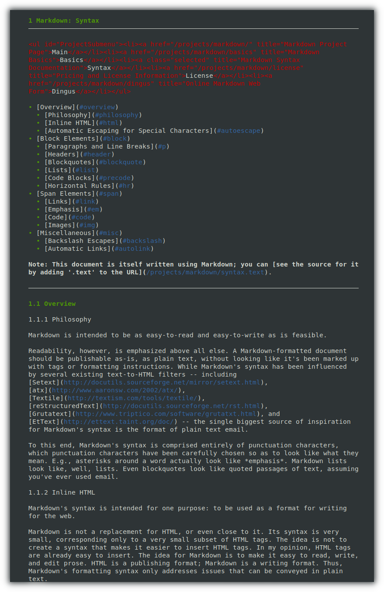
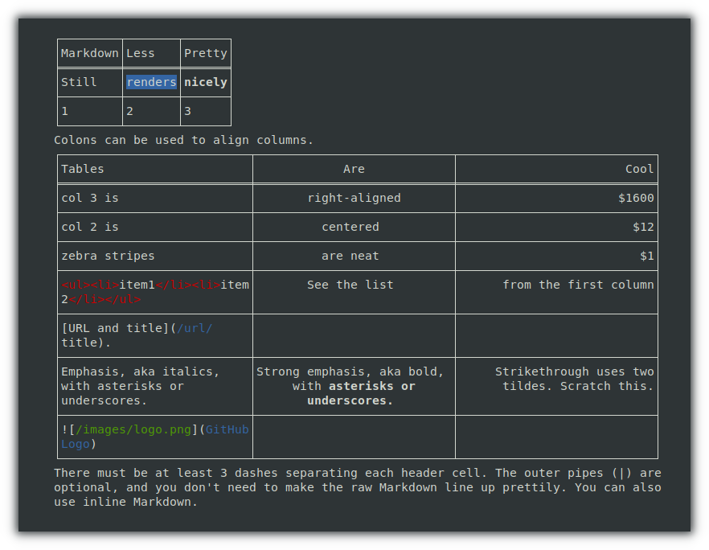
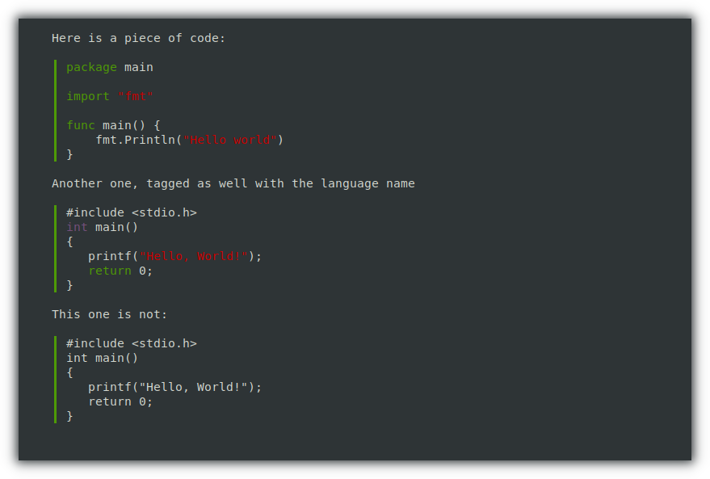

# mdr : MarkDown Renderer

`mdr` is a standalone Markdown renderer for the terminal.

Note: Markdown being originally designed to render as HTML, rendering in a terminal is occasionally challenging and some adaptation had to be made. 

## Examples

## Installation

You can grab a [pre-compiled binary](https://github.com/MichaelMure/mdr/releases/latest)

## Keybindings

| Action | Key |
|--------|-----|
| Quit | <kbd>ctrl+C</kbd>, <kbd>Q</kbd>|
| Up | <kbd>↑</kbd>, <kbd>K</kbd> |
| Down | <kbd>↓</kbd>, <kbd>J</kbd> |
| Page Up | <kbd>⇞</kbd> |
| Page Down | <kbd>⇟</kbd>, <kbd>space</kbd> |

## Origin

This tool is an offspring of the [git-bug](https://github.com/MichaelMure/git-bug) project.

## Contribute

PRs accepted.

## License

MIT
